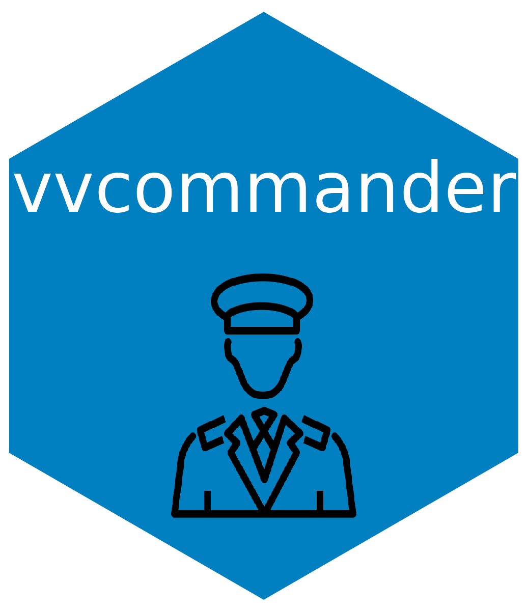

# vvcommander 

  <!-- badges: start -->
  
  <!-- badges: end -->

The `vvcommander` package contains a collection of helper functions designed to simplify and streamline common tasks in R programming. Furthermore, the package provides methods to set project settings in R. 

## Contribution Guidelines

Contributions to vvcommander are welcome. The standard GitHub process should be followed for contributing: fork the repository, make changes, and submit a pull request.
